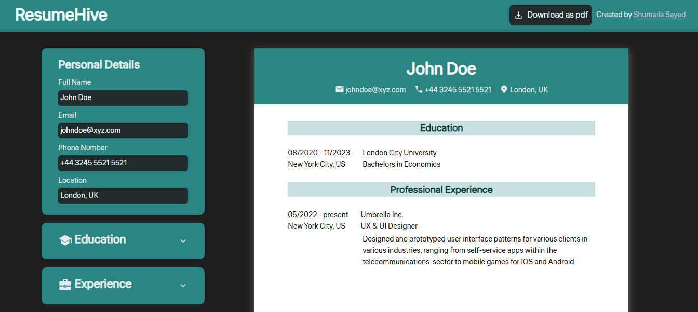

# ResumeHive

## 🚀 Overview
Resume Builder is a React app that allows users to create a structured resume by filling in their general information, educational background, and work experience. Users can dynamically add multiple education and experience entries.

## ✨ Features
- 📝 **General Information Section**: Add your name, email, location, and phone number.
- 🎓 **Education Section**: Enter multiple educational experiences, including school name, degree, location, field of study, and duration.
- 💼 **Work Experience Section**: Add multiple job experiences, including company name, position title, location, responsibilities, and work duration.
- ➕ **Dynamic Add Entries**: Click "Add Education" and "Add Experience" buttons to input multiple entries.
- 👀 **Live Preview**: See your resume format updating in real-time as you fill out the form.

## 🖼 Screenshots

## 🌍 Deployment
This project is deployed on Vercel. You can check it out [here](https://resume-hive.vercel.app/)

## 🛠 Technologies Used
- ⚛️ React.js
- 🎨 CSS
- 🚀 JavaScript (ES6+)

## 📜 License
This project is open-source and free to use.

---

Happy coding!